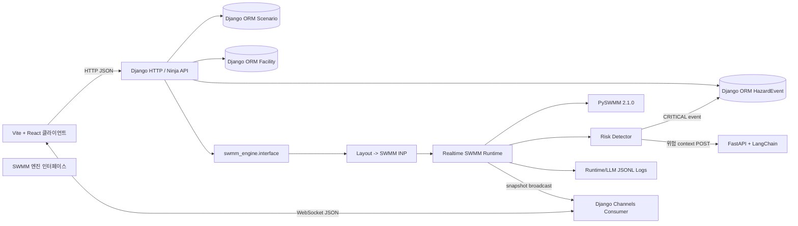

# 전체 시스템 구조

## 문서 정보

- 기준일: 2026-06-29
- 기준 구현: `config`, `apps`, `swmm_engine`

## 범위

이 저장소는 지능형 도시침수 관리 시스템의 Django 백엔드다. React 클라이언트에서
저장한 배수도 layout JSON을 DB에 보관하고, 선택한 layout을 SWMM INP로 변환해
PySWMM 런타임 세션으로 실행한다. 엔진 snapshot은 HTTP 응답과 Channels
WebSocket으로 전달된다.

React 클라이언트와 FastAPI LangChain 서버는 외부 시스템이며 이 저장소에서
구현하지 않는다. LangChain 호출은 `swmm_engine/llm_dispatcher.py`에서
위험 trigger 발생 시 `SUPERMARIO_LLM_ANALYZE_URL`로 POST한다.

## 관련 문서

| 문서 | 내용 |
| --- | --- |
| `api-spec.md` | HTTP API 계약 |
| `websocket-spec.md` | WebSocket 연결과 snapshot 구조 |
| `policy.md` | 인증, 위험, forecast, 우선순위, 문자 발송, 조치 정책 |
| `features.md` | 기능별 구현 현황 |
| `technology.md` | 기술 스택과 외부 연동 |
| `data-model.md` | Django DB 모델과 VectorDB 논리 모델 |
| `db-design.md` | DB 테이블 상세 |
| `swmm-spec.md` | SWMM 입출력과 risk snapshot 구조 |

## 구성도



## 모듈 책임

| 경로                            | 책임                                                                            |
| ------------------------------- | ------------------------------------------------------------------------------- |
| `config`                        | Django 설정, HTTP URL, ASGI HTTP/WebSocket 라우팅                               |
| `apps/common`                   | dataclass 기반 공통 DTO                                                         |
| `apps/auth`                     | JWT 로그인, refresh rotation, `/api` 보호 middleware, custom users table        |
| `apps/facilities`               | 시설 기준값 저장용 class-based view와 모델                                      |
| `apps/monitoring`               | CRITICAL 위험 로그 저장, 조치 입력, embedding 이력 관리                         |
| `apps/notification`             | Telegram bot token과 알림 수신자 chat ID 관리                                  |
| `apps/scenarios`                | React editor layout JSON 시나리오 CRUD                                          |
| `apps/simulation`               | SWMM 엔진 API, 에디터 변환 API, WebSocket consumer, 전역 엔진 상태              |
| `swmm_engine/converter`         | React editor layout JSON을 SWMM INP/report/mapping으로 변환                     |
| `swmm_engine/engine`            | PySWMM 세션 생성, tick loop, pause/resume/stop/control 처리                     |
| `swmm_engine/risk`              | snapshot 구조 검증, deterministic 위험 이벤트 판정, 우선순위 점수 계산, LLM context 생성 |
| `swmm_engine/llm_dispatcher.py` | 위험 snapshot을 외부 LLM 서버로 전송하고 LangChain 상황 ID와 문자 발송 묶음/cooldown 정책을 관리 |
| `legacy`                        | 예전 `/api/simulations/` 흐름과 테스트 보관                                     |
| `backend/docs`                  | 현재 구현 기준 기술 문서                                                        |

## 주요 처리 흐름

### 인증

1. 클라이언트가 `POST /api/auth/login`으로 `username`, `password`를 보낸다.
2. 서버는 custom `users` 테이블에서 ADMIN 사용자를 조회하고 Django password
   hasher로 비밀번호를 검증한다.
3. 성공 시 access token을 body로, refresh token을 `refresh_token` HttpOnly
   Secure SameSite 쿠키로 반환한다.
4. `ApiJwtAuthenticationMiddleware`는 로그인, refresh, health를 제외한 모든
   HTTP `/api` 요청에서 access token을 검증한다.
5. `POST /api/auth/refresh`는 refresh cookie와 DB에 저장된 hash를 비교하고,
   성공 시 access/refresh token을 모두 rotation한다.

초기 ADMIN 생성은 `ensure_admin_user --only-if-no-admin`로 수행한다. 기본
`admin` row가 이미 있으면 기본 비밀번호 `supermario4`로 갱신하고,
다른 ADMIN 사용자가 이미 있으면 건너뛴다.

### 시나리오 저장

1. React 편집모드가 `POST /api/scenarios`로 `title`, `description`,
   `layoutJson`을 보낸다.
2. `apps/scenarios`가 `Scenario` row를 생성한다.
3. 목록, 상세, 수정, 삭제 API는 같은 `layout_json`을 source data로 사용한다.
4. 삭제는 `is_active=false` soft delete다.

### 시설 초기값 저장

1. 클라이언트가 `POST /api/facilities/`로 시설 단건 또는 배열을 보낸다.
2. 서버는 `name`, `facility_type`, `normal_value`, `metadata`를 검증한다.
3. 같은 `name`이 있으면 `update_or_create`로 갱신한다.
4. 현재 SWMM 런타임 시작 경로는 시설 DB를 필수 입력으로 요구하지 않는다.

### 에디터 변환

1. 클라이언트가 `/api/editor/convert/validate` 또는 다운로드 API에 layout을 보낸다.
2. `swmm_engine.interface.convert_layout_to_inp()`가 converter를 호출한다.
3. 결과는 INP 텍스트, conversion report, React editor와 SWMM 객체 mapping이다.
4. 변환 오류가 있으면 `422`로 반환된다.

### 엔진 실행과 방송

1. 클라이언트가 `/api/ws/simulation`에 연결한다.
2. 서버는 최신 snapshot이 있으면 snapshot을, 없으면 status payload를 즉시 보낸다.
3. 클라이언트가 `POST /api/engine/start`로 `layout`, `stepSeconds`, `control`을 보낸다.
4. 런타임은 layout을 SWMM INP로 변환하고 임시 파일로 PySWMM 세션을 연다.
5. `SwmmRuntimeEngine.run_loop()`가 `stepSeconds / speedMultiplier` 간격으로 tick을 진행한다.
6. 각 tick에서 강수/막힘 제어를 적용하고 `nodes`, `links`, `editorObjects`,
   `summary`, `risk`, `llmTrigger`를 포함한 snapshot을 만든다.
7. `apps/simulation/state.py`가 snapshot을 Channels group `simulation`으로 broadcast한다.
8. snapshot은 JSONL tick log에도 기록된다.
9. `apps/simulation/state.py`는 broadcast 직전에 snapshot의 `risk.events` 중
   `severity=CRITICAL`인 이벤트를 `apps.monitoring`에 전달한다.
10. `apps.monitoring`은 현재 프로젝트의 실제 risk event 키인 `eventType`,
   `source`, `sourceId`, `severity`를 사용해 `HazardEvent`를 생성한다.
   `event_key=runId:hazard_type:target_id:hazard_level`로 같은 실행의 중복 위험
   로그 생성을 방지한다.
   위험 이벤트에는 `priorityScore`, `priorityBand`, `priorityReasons`를 계산해
   붙인다. 우선순위는 침수/월류, 역류, 100% 막힘, node 위험, 수치 초과량,
   forecast 상승 기울기를 기준으로 산정한다.
11. `apps.monitoring.services.forecast_state`는 broadcast snapshot에서 예측에
   필요한 최소 metric만 runtime 메모리 buffer에 저장한다. 수위 변화량 metric과
   함께 React 제어에서 들어온 `links.blockageRatio`도 저장한다.
12. 최근 관측 구간의 변화량으로 기본 10분 뒤 상태를 예측한다. 시작 직후의
   0 기반 과대 예측을 줄이기 위해 최소 관측 시간과 강수 상황별 최소 현재값을
   만족한 metric만 위험 이벤트로 만든다. 단, 관 막힘은 사용자가 시뮬레이션 중
   변경한 현재 제어 상태이므로 `blockageRatio >= 1.0`이면 관측 안정화 시간
   전에도 CRITICAL forecast event로 만든다. forecast 결과에 `CRITICAL` 이벤트가
   있으면 `llm_dispatcher`가 `.env`의 bot token과 DB에 저장된 수신자 chat ID를
   붙여 forecast context를 `SUPERMARIO_LLM_ANALYZE_URL`로 POST한다. 즉 LLM 분석
   요청 기준은 현재 위험 발생이 아니라 10분 뒤 위험 예측 또는 직접 제어된 막힘
   위험이다.

```json
{
  "id": "폭우",
  "swmm_raw_data": "{...sanitized context json...}",
  "TELEGRAM_BOT_TOKEN": "...",
  "TELEGRAM_CHAT_ID": ["..."]
}
```

### 위험 로그와 조치 이력

1. React 클라이언트는 `GET /api/hazards?status=OPEN`으로 처리 대상 위험 로그를
   polling 방식으로 조회할 수 있다.
2. 목록 응답은 Grid 표시용 DTO만 포함하며 SWMM snapshot 원본 전체를 반환하지
   않는다.
3. 상세 조회 `GET /api/hazards/{id}`는 해당 위험 대상의 당시 수치만
   `metrics_snapshot`으로 반환한다.
4. 관리자가 `POST /api/hazards/{id}/actions`로 조치 내용을 저장하면
   `HazardAction`이 생성되고 `HazardEvent`는 `status=IN_PROGRESS`로 변경된다.
5. 조치 시작 단계에는 결과가 없으므로 `HazardCaseEmbedding`을 만들지 않고
   FastAPI/LangChain maintenance log endpoint로도 전송하지 않는다.
6. 관리자가 `PATCH /api/hazards/{id}/actions/{action_id}`로 결과 상세와 재발 시
   참고사항을 저장하면 기존 `HazardAction`이 업데이트된다.
7. 조치 완료 시 `HazardEvent`는 실제 삭제하지 않고 `status=RESOLVED`,
   `is_deleted=true`, `resolved_at=현재 시각`으로 논리 삭제된다.
8. 조치 완료 시점에 위험 상황, 조치 내용, 결과, 재발 참고사항을 결합한
   `embedding_text`를 만들고 `HazardCaseEmbedding`에 저장한다. 현재 VectorDB
   연동은 MVP 더미 구현으로 `hazard-case-{uuid}` 형식의 `vector_id`만 생성한다.
9. Django는 위험 사건, 당시 주요 지표, 조치/결과/재발 참고사항을 구조화해
   FastAPI/LangChain 서버의 maintenance log endpoint로 POST한다. 요청 body는
   `event`, `metrics`, `action` 객체를 포함한다.
10. FastAPI 응답의 `vector_id` 또는 실패 메시지는 `HazardAction`의
   `fastapi_*` 필드에 저장한다. FastAPI 연동 실패는 조치 저장과 위험 로그 완료
   처리를 롤백하지 않는다.

### 10분 위험 예측

1. `state.broadcast()`가 모든 snapshot을 `forecast_state.record_snapshot()`에
   전달한다.
2. forecast state는 전체 snapshot을 저장하지 않고 `links.fullness`,
   `links.capacityRatio`, `links.blockageRatio`, `nodes.depthRatio`,
   `nodes.floodingCms` 같은 최소 metric만 최근
   `SUPERMARIO_FORECAST_BUFFER_SECONDS` 동안 메모리에 유지한다.
3. `GET /api/hazards/forecast?minutes=10`은 최근
   `SUPERMARIO_FORECAST_WINDOW_SECONDS`초 안의 sample 기울기 중앙값을 기준으로
   미래 값을 외삽한다.
4. `SUPERMARIO_FORECAST_MIN_OBSERVATION_SECONDS`보다 관측 구간이 짧으면 변화량
   기반 metric은 `NORMAL` forecast를 반환하고 LLM dispatch payload를 만들지
   않는다. `links.blockageRatio`는 제어 상태 자체가 위험 신호이므로 이 안정화
   조건의 예외다.
5. 맑음/우천/호우/폭우의 `rainfallRatio`에 따라 최소 현재 수위 기준을 다르게
   적용한다. 예측값이 `CRITICAL` 기준 이상이어도 현재값이 너무 낮으면
   위험 이벤트로 만들지 않는다.
6. `links.blockageRatio >= 1.0`은 `PREDICTED_BLOCKAGE_CLOSED` CRITICAL,
   `0.8 <= links.blockageRatio < 1.0`은 `PREDICTED_BLOCKAGE_HIGH` WARNING으로
   만든다.
7. 예측 결과의 `WARNING/CRITICAL` 이벤트는 React가 표시할 수 있고,
   `CRITICAL` 예측은 LLM dispatch의 입력 기준으로 사용된다.
8. forecast `riskEvents`도 우선순위 점수를 포함한다. 따라서 LLM 서버는
   `swmm_raw_data`의 `riskEvents[].priorityScore`, `priorityBand`,
   `priorityReasons`로 여러 위험 중 먼저 조치할 대상을 판단할 수 있다.
9. 이 1차 구현은 단일 프로세스 runtime state 기반이다. 서버 재시작 또는 다중
   프로세스 배포에서는 예측 buffer가 공유되지 않는다.

## SWMM 교체 지점

Django 계층은 가능하면 `swmm_engine.interface`만 import한다.

| 공개 함수                            | 역할                                       |
| ------------------------------------ | ------------------------------------------ |
| `convert_layout_to_inp()`            | React layout을 INP/report/mapping으로 변환 |
| `create_engine_session()`            | `SwmmRuntimeEngine` 생성                   |
| `start_engine()`                     | 새 runtime 세션 시작                       |
| `apply_controls()`                   | 강수, 막힘, 배속 제어 변경                 |
| `pause_engine()` / `resume_engine()` | tick loop 일시정지와 재개                  |
| `stop_engine()`                      | 세션 종료                                  |
| `validate_snapshot()`                | snapshot 구조 검증                         |
| `detect_risks()`                     | 위험 이벤트 판정                           |
| `build_llm_context()`                | LLM 분석용 context 생성                    |

향후 실제 SWMM 엔진 인터페이스가 별도 제공되면 `swmm_engine.interface` 뒤쪽 구현을
교체하고, Django API와 WebSocket 계약은 유지하는 방향이 적합하다.

## 런타임 상태와 제한

- 현재 엔진 세션은 `apps/simulation/state.py`의 프로세스 전역 객체 하나다.
- 다중 사용자/다중 시나리오 동시 실행을 분리하는 세션 registry는 아직 없다.
- Channel Layer는 `InMemoryChannelLayer`이므로 단일 프로세스용이다.
- 다중 인스턴스 배포 전에는 Redis Channel Layer와 세션 저장소가 필요하다.
- tick log는 `swmm_engine/logs/runtime-tick-logs/*.jsonl`에 기록되고 Git에는 포함하지 않는다.

## 배포 구조

Daphne가 ASGI 애플리케이션을 실행하며 HTTP와 WebSocket을 모두 처리한다.
Docker Compose는 PostgreSQL을 함께 실행하고 `postgres_data` 볼륨에 DB 데이터를 보존한다. Python 단독 실행은 별도 DB 환경변수가 없으면 SQLite fallback을 사용한다.

현재 채널 계층은 프로세스 메모리 기반이므로 단일 프로세스용이다. 다중 인스턴스
배포 전에는 Redis 기반 Channel Layer로 교체해야 한다.

LEVEL 5 데모는 `stepSeconds=1`, `durationSeconds=30`, `realtime=true`,
`broadcastIntervalSeconds=1`을 사용한다. SWMM 계산이 완료된 뒤 무제한으로
빠르게 방송하지 않고 중지 이벤트를 기다리는 방식으로 실제 1초 간격을 유지한다.

Docker 이미지는 PySWMM 지원 범위에 맞춰 Python 3.12 slim을 사용한다.
