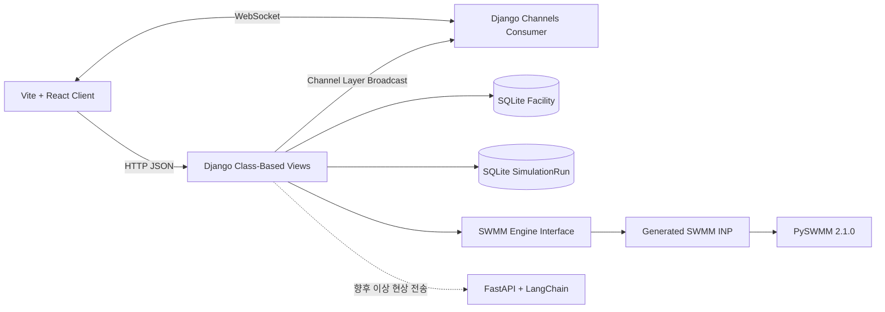

# 전체 시스템 구조

## 범위

이 저장소는 지능형 도시침수 관리 시스템의 Django 백엔드다. 시설 정상값 저장,
시뮬레이션 실행, 이상 현상 판정, 결과 WebSocket 방송을 담당한다.

React 클라이언트와 LangChain 서버는 외부 시스템이며 이 저장소에서 구현하지
않는다. LangChain 이상 알림 전송도 현재 연결되지 않았다.

## 구성도

## 모듈 책임

| 경로 | 책임 |
| --- | --- |
| `apps/common` | 도메인별 요청/응답 DTO와 공통 응답 직렬화 |
| `apps/facilities` | 시설 정상 상태 모델, CRUD 및 초기화 API |
| `apps/simulation` | 실행 이력, 시뮬레이션 API, WebSocket Consumer |
| `swmm_engine` | 클라이언트 모델 정규화, 입력 계약 검증, INP 생성, PySWMM 실행 및 결과 수집 |
| `config` | Django 설정, HTTP URL, ASGI 프로토콜 라우팅 |
| `docs` | 구현 기준 기술 문서 |

## 주요 처리 흐름

### 시설 초기화

1. 클라이언트가 `POST /api/facilities/`로 시설 목록을 보낸다.
2. 백엔드가 입력값을 검증한다.
3. 하나라도 잘못된 입력이면 전체 요청을 거부한다.
4. 트랜잭션 안에서 `name` 기준으로 생성 또는 갱신한다.
5. 저장된 정상 상태를 공통 응답 DTO로 반환한다.

시설 `metadata`의 초기 수위와 장애 조건은 시뮬레이션 시작 시 모델에 병합된다.
빗물받이와 맨홀은 Junction 초기 수심, 관로는 추정 초기 유량으로 변환한다.
빗물받이 폐색은 해당 노드에서 출발하는 관로에 적용된다.

### 시뮬레이션 및 방송

1. 클라이언트가 `/ws/simulation/`을 구독한다.
2. 클라이언트가 `POST /api/simulations/`로 강수 상황을 보낸다.
3. 백엔드가 활성 시설의 정상값을 조회한다.
4. 모델과 제어 계약을 검증하고 SWMM `.inp` 내용을 생성한다.
5. PySWMM이 지정된 계산 간격으로 동적 파랑 해석을 실행한다.
6. 각 단계의 노드 수심·침수량과 관로 유량·충만도를 WebSocket으로 방송한다.
7. 노드 깊이 80% 이상 또는 침수 발생, 관로 충만도 90% 이상을 이상으로 판정한다.
8. 최대 측정값과 최종 이상 결과를 `SimulationRun`에 저장하고 방송한다.

## SWMM 교체 지점

`PySwmmEngine`은 `swmm_engine.engine.BaseSwmmEngine`을 구현한다.

- `start(...) -> dict`: JSON 직렬화 가능한 결과 반환
- `stop() -> None`: 실행 중인 계산 중지

현재 `get_engine()`은 `PySwmmEngine` 단일 인스턴스를 반환한다. 동시 실행은
잠금으로 거부하며 `stop()`은 현재 실행에 중지 플래그를 전달한다.

## 모델 변환

클라이언트 배치 JSON은 아직 확정되지 않았으므로 엔진은
`normalize_model_payload()`를 통해 입력을 내부 그래프 계약으로 먼저 변환한다.
현재는 기존 `nodes`/`links` UI 그래프와 SWMM 섹션형
`junctions`/`outfalls`/`conduits` JSON을 지원한다.

- 링크에 연결된 UI 노드 또는 SWMM 섹션 노드만 수리 노드로 사용한다.
- 유출 링크가 없는 말단 노드는 Outfall, 나머지는 Junction으로 변환한다.
- UI 관계 링크는 원형 Conduit로 변환한다.
- `size`는 기본 관경으로, `blockage`는 유효 관경 감소로 반영한다.
- 강수는 Rain Gage와 Time Series, 상류 노드는 Subcatchment로 변환한다.
- `x`, `y`는 SWMM 좌표 및 관로 길이 산정에 사용한다.

## 배포 구조

Daphne가 ASGI 애플리케이션을 실행하며 HTTP와 WebSocket을 모두 처리한다.
Docker Compose는 SQLite 파일을 `sqlite_data` 볼륨에 보존한다.

현재 채널 계층은 프로세스 메모리 기반이므로 단일 프로세스용이다. 다중 인스턴스
배포 전에는 Redis 기반 Channel Layer로 교체해야 한다.

LEVEL 5 데모는 `stepSeconds=1`, `durationSeconds=30`, `realtime=true`,
`broadcastIntervalSeconds=1`을 사용한다. SWMM 계산이 완료된 뒤 무제한으로
빠르게 방송하지 않고 중지 이벤트를 기다리는 방식으로 실제 1초 간격을 유지한다.

Docker 이미지는 PySWMM 지원 범위에 맞춰 Python 3.12 slim을 사용한다.
