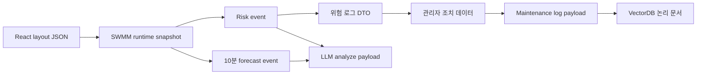

# 데이터 모델 문서

## 문서 정보

- 기준일: 2026-07-01
- 기준 구현: `apps/monitoring`, `apps/simulation`, `swmm_engine/risk`, `swmm_engine/llm_dispatcher.py`

이 문서는 데이터의 업무적 의미와 시스템 간 전달 모델을 설명한다. 실제 DB 테이블,
컬럼, 타입, 제약, migration은 `db-design.md`를 기준으로 한다.

## 문서 역할 구분

| 문서            | 책임                                                                                 |
| --------------- | ------------------------------------------------------------------------------------ |
| `db-design.md`  | Django ORM 모델, 실제 테이블, 컬럼, 타입, 제약, migration                            |
| `data-model.md` | SWMM snapshot에서 위험, 조치, LLM payload, VectorDB 논리 문서로 이어지는 데이터 의미 |

따라서 이 문서에서는 DB 컬럼 목록을 반복하지 않고, 어떤 데이터가 어떤 목적의
모델로 변환되는지만 다룬다.

## 전체 데이터 흐름



현재 source of truth는 SWMM runtime snapshot이다. DB는 운영 상태를 보존하기 위한
저장소이며, 외부 LLM 서버로 보낼 payload는 snapshot, 위험 이벤트, 조치 이력을
목적에 맞게 축약한 전달 모델이다.

## Scenario Layout 모델

React 편집모드에서 저장한 layout JSON은 SWMM 모델 생성의 입력이다.

| 데이터   | 의미                                  |
| -------- | ------------------------------------- |
| `nodes`  | 건물, 빗물받이, 커넥터 등 editor 객체 |
| `links`  | editor 객체 사이 연결                 |
| `swmmId` | SWMM node/link로 변환될 기준 ID       |
| `props`  | 크기, 막힘, 경사 등 확장 속성         |

layout JSON은 그대로 SWMM 계산 결과가 아니며, `swmm_engine/converter`를 거쳐 INP
모델과 editor-SWMM mapping으로 변환된다.

## Runtime Snapshot 모델

runtime snapshot은 WebSocket으로 React에 broadcast되는 실시간 상태 모델이다.

| 구분          | 주요 데이터                                                                 | 의미                                |
| ------------- | --------------------------------------------------------------------------- | ----------------------------------- |
| simulation    | `runId`, `stepIndex`, `modelTime`, `stepSeconds`                            | 현재 SWMM 실행 위치                 |
| control       | `rainfallRatio`, `maxRainfallMmPerHour`, `blockagesById`, `speedMultiplier` | React가 부여한 제어 상태            |
| nodes         | `depthRatio`, `floodingCms`, `totalInflowCms`                               | node 수위와 월류 상태               |
| links         | `fullness`, `capacityRatio`, `flowCms`, `direction`, `blockageRatio`        | 관로 충만도, 용량, 흐름, 막힘       |
| editorObjects | editor 객체별 집계 수치                                                     | 화면 표시용 요약                    |
| risk          | deterministic 위험 판정 결과                                                | 화면 표시와 LLM trigger 판단에 사용 |

전체 snapshot은 LLM 서버에 그대로 보내지 않는다. LLM 전송 전에는 필요한 필드만
남기고 로컬 파일 경로와 디버그 metadata를 제거한다.

## Risk Event 모델

Risk event는 runtime snapshot에서 deterministic rule로 만들어진 위험 단위다.

| 필드        | 의미                                                 |
| ----------- | ---------------------------------------------------- |
| `eventType` | 위험 유형. 예: `REVERSE_FLOW`, `PREDICTED_FULL_PIPE` |
| `severity`  | `NORMAL`, `WATCH`, `WARNING`, `CRITICAL`             |
| `source`    | `node`, `link`, `editorObject` 등                    |
| `sourceId`  | 실제 위험 대상 ID                                    |
| `metrics`   | 위험 판단에 사용된 주요 수치                         |
| `reason`    | 사람이 읽을 수 있는 위험 설명                        |

현재 DB 위험 로그와 문자 발송 후보는 `severity=CRITICAL` 이벤트를 중심으로 한다.

## Forecast Event 모델

Forecast event는 runtime state 메모리 buffer의 최근 sample을 기반으로 만든 미래
위험 모델이다.

| 데이터            | 의미                                  |
| ----------------- | ------------------------------------- |
| `currentValue`    | 현재 metric 값                        |
| `predictedValue`  | 기본 10분 뒤 예측값                   |
| `slopePerSecond`  | 최근 관측 구간의 변화량               |
| `forecastMinutes` | 예측 horizon                          |
| `rainfallLevel`   | 현재 강수 수준 분류                   |
| `minCurrentValue` | 예측을 신뢰하기 위한 현재값 최소 기준 |

변화량 기반 metric은 최소 관측 시간과 현재값 최소 조건을 통과해야 한다.
`blockageRatio`는 사용자가 직접 제어한 현재 상태이므로 수위 변화량과 별개로
forecast 위험 원인이 될 수 있다.

## Priority 모델

Priority 모델은 여러 위험 중 현장 대처 순서를 정하기 위한 점수 모델이다.

| 필드              | 의미                           |
| ----------------- | ------------------------------ |
| `priorityScore`   | 정렬 가능한 숫자 점수          |
| `priorityBand`    | `P1`, `P2`, `P3`, `P4` 등 구간 |
| `priorityReasons` | 점수 산정 이유 목록            |

우선순위는 현재 침수/월류, 역류, 100% 막힘, node 위험, 수치 초과량, forecast 상승
속도를 반영한다. 이 값은 React 표시, LLM 분석, maintenance log payload에 모두
사용된다.

## Hazard Log DTO 모델

Hazard log DTO는 React가 위험 목록과 상세 화면을 구성하기 위한 모델이다.

목록 DTO는 Grid 표시를 위해 축약된다.

```json
{
  "id": 1,
  "target_id": "PIPE_1",
  "source": "link",
  "hazard_level": "CRITICAL",
  "hazard_type": "REVERSE_FLOW",
  "hazard_detail": "파이프에서 역류가 감지되었습니다.",
  "status": "OPEN",
  "priorityScore": 177.0,
  "priorityBand": "P1",
  "priorityReasons": ["CRITICAL 위험", "역류 위험"],
  "created_at": "2026-06-29T12:00:00"
}
```

상세 DTO는 해당 대상의 당시 주요 수치인 `metrics_snapshot`과 조치 이력을 함께
반환한다. 전체 runtime snapshot 원본은 반환하지 않는다.

## LLM Analyze Payload 모델

LLM analyze payload는 위험 분석과 문자 발송을 위해 외부 LLM 서버로 보내는 모델이다.

```json
{
  "id": "폭우",
  "swmm_raw_data": "{...context json string...}",
  "TELEGRAM_BOT_TOKEN": "...",
  "TELEGRAM_CHAT_ID": ["..."]
}
```

| 필드                 | 의미                                                                                                       |
| -------------------- | ---------------------------------------------------------------------------------------------------------- |
| `id`                 | 강수 상황 식별자. `맑음`, `우천`, `호우`, `폭우` 4단계로 정규화하며 `약한비`/`비옴`은 `우천`으로 호환 처리 |
| `swmm_raw_data`      | LLM이 분석할 SWMM 위험 context JSON 문자열                                                                 |
| `TELEGRAM_BOT_TOKEN` | `.env`에서 읽은 Telegram bot token                                                                         |
| `TELEGRAM_CHAT_ID`   | `NotificationRecipient` DB row에서 읽은 수신자 chat ID 목록                                                |

`swmm_raw_data` 내부에는 `riskEvents`, `forecastPredictions`, `simulation`,
`systemMeta` 등이 포함될 수 있다. `riskEvents`에는 우선순위 필드도 포함된다.

## 조치 입력 모델

관리자 조치 데이터는 시간적으로 두 번에 나뉘어 들어온다.

| 단계      | React 입력                         | 의미                            |
| --------- | ---------------------------------- | ------------------------------- |
| 조치 시작 | `action_detail`                    | 현장에서 어떤 조치를 시작했는지 |
| 조치 완료 | `result_detail`, `recurrence_note` | 조치 결과와 재발 시 참고사항    |

조치 시작만 있는 상태는 아직 embedding 대상이 아니다. 결과가 들어온 완료 시점에
위험 상황과 조치, 결과를 결합해 외부 LLM 서버로 보낸다.

## Maintenance Log Payload 모델

Maintenance log payload는 조치 완료 시 FastAPI/LangChain 서버로 보내는 구조화
모델이다.

```json
{
  "event": {
    "id": 1,
    "run_id": "20260624-164620-7faf56be",
    "step_index": 3087,
    "model_time": "2026-06-16T00:51:27",
    "target_id": "PIPE_1",
    "source": "link",
    "hazard_type": "REVERSE_FLOW",
    "hazard_level": "CRITICAL",
    "hazard_detail": "파이프에서 역류가 감지되었습니다.",
    "priority": {
      "priorityScore": 177.0,
      "priorityBand": "P1",
      "priorityReasons": ["CRITICAL 위험", "역류 위험"]
    },
    "created_at": "2026-06-26T15:51:00"
  },
  "metrics": {
    "flowCms": -0.034,
    "direction": "reverse"
  },
  "action": {
    "status": "RESOLVED",
    "initial_action_detail": "하류 관로 현장 점검 진행",
    "action_type": "FIELD_CHECK",
    "result_detail": "토사 제거 후 수위 안정화",
    "result_status": "RESOLVED",
    "recurrence_note": "폭우 시 상류 맨홀 우선 점검",
    "created_at": "2026-06-26T15:52:00"
  }
}
```

이 payload는 외부 LLM 서버가 조치 사례 보고서를 만들고 embedding할 수 있도록
사건, 지표, 조치, 결과를 분리해 제공한다.

## VectorDB 논리 문서 모델

실제 VectorDB는 이 Django 저장소에서 구현하지 않는다. 현재 Django가 제공하는
데이터로 만들 수 있는 VectorDB 논리 문서는 다음 구성을 갖는다.

| 구분      | 포함 정보                                              |
| --------- | ------------------------------------------------------ |
| 사건 식별 | event id, run id, step index, model time               |
| 대상      | source, target id                                      |
| 위험      | hazard type, hazard level, hazard detail               |
| 우선순위  | score, band, reasons                                   |
| 지표      | flow, fullness, capacity, blockage, depth, flooding 등 |
| 조치      | initial action detail, action type                     |
| 결과      | result detail, result status                           |
| 재발 참고 | recurrence note                                        |

Django는 VectorDB 문서 본문을 직접 생성하지 않는다. 구조화 payload를 전달하고,
외부 FastAPI/LangChain 서버가 보고서 포맷팅, embedding, Chroma 저장을 담당한다.

## Django 내부 embedding 이력

Django는 외부 VectorDB 저장 결과를 추적하기 위해 내부 이력을 남긴다. 이 이력은
VectorDB 자체가 아니라 연동 상태 기록이다.

| 데이터           | 의미                                             |
| ---------------- | ------------------------------------------------ |
| `embedding_text` | Django가 만든 기본 결합 텍스트                   |
| `vector_id`      | 외부 서버가 반환한 ID 또는 MVP 임시 ID           |
| `metadata`       | event id, target id, 위험 유형 등 검색 보조 정보 |

## 현재 백엔드 데이터로 얻을 수 없는 정보

현재 백엔드 프로젝트만으로는 아래 데이터를 얻지 못한다.

- 기상청 관측 데이터
- 최근 12시간 실제 강수량
- 실제 습도
- 향후 기상 예보
- 인근 지역 침수 이력
- 행정/현장 기준의 배수 시스템 설계 용량
- 구조적 결함 또는 유지보수 이력

이 정보가 LLM 응답에 포함된다면 Django payload가 아니라 외부 LLM 서버의 더미
데이터, VectorDB 검색 결과, 또는 생성 결과에서 나온 것으로 봐야 한다.
