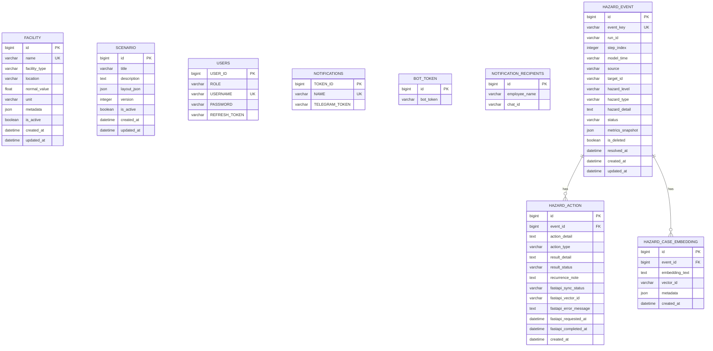

# 데이터베이스 구조

## 문서 정보

- DBMS: PostgreSQL for Docker/production, SQLite fallback for bare local Python
- Django ORM: Django 6.0.6
- Python 단독 실행 기본 DB: `db.sqlite3`
- Docker/production DB: PostgreSQL `postgres_data` volume
- 시간대: `Asia/Seoul`

## 데이터베이스 설정

`DATABASE_ENGINE=postgres`이면 PostgreSQL을 사용하고, 그 외에는 SQLite를 사용한다.

| 환경 변수 | 기본값 | 설명 |
| --- | --- | --- |
| `DATABASE_ENGINE` | `sqlite` | `sqlite` 또는 `postgres` |
| `SQLITE_PATH` | `BASE_DIR / db.sqlite3` | SQLite 파일 경로 |
| `POSTGRES_DB` | `supermario` | PostgreSQL DB 이름 |
| `POSTGRES_USER` | `supermario` | PostgreSQL 사용자 |
| `POSTGRES_PASSWORD` | 빈 문자열 | PostgreSQL 비밀번호 |
| `POSTGRES_HOST` | `postgres` | PostgreSQL 호스트 |
| `POSTGRES_PORT` | `5432` | PostgreSQL 포트 |

## ERD



위험 로그 관련 테이블은 `HazardEvent`를 기준으로 조치 이력과 embedding 저장
이력이 외래 키로 연결된다. SWMM 런타임 snapshot 원본과 tick log는 DB가 아니라
`swmm_engine/logs/runtime-tick-logs/*.jsonl` 파일에 기록된다.

## Facility

클라이언트 초기화 API에서 전달받은 시설 기준값과 확장 metadata를 저장한다.

| 컬럼 | Django 타입 | Null | 기본값 | 제약/설명 |
| --- | --- | --- | --- | --- |
| `id` | BigAutoField | 아니요 | 자동 증가 | PK |
| `name` | CharField(100) | 아니요 | 없음 | Unique |
| `facility_type` | CharField(30) | 아니요 | `OTHER` | 시설 유형 선택값 |
| `location` | CharField(255) | 아니요 | 빈 문자열 | 위치 설명 |
| `normal_value` | FloatField | 아니요 | `0.0` | 정상 상태 기준값 |
| `unit` | CharField(20) | 아니요 | 빈 문자열 | 기준값 단위 |
| `metadata` | JSONField | 아니요 | `{}` | SWMM ID, 임계값 등 확장 데이터 |
| `is_active` | BooleanField | 아니요 | `true` | 활성 여부 |
| `created_at` | DateTimeField | 아니요 | 생성 시각 | 자동 기록 |
| `updated_at` | DateTimeField | 아니요 | 수정 시각 | 자동 갱신 |

허용 `facility_type` 값은 다음과 같다.

| 값 | 설명 |
| --- | --- |
| `DRAINAGE_PIPE` | 배수관 |
| `CATCH_BASIN` | 빗물받이 |
| `MANHOLE` | 맨홀 |
| `PUMP` | 펌프 |
| `OTHER` | 기타 |

기본 조회 순서는 `id` 오름차순이다. 시설 삭제 API는 현재 hard delete를 수행한다.

## Scenario

React 편집모드에서 저장한 배수도 layout JSON을 보관한다.

| 컬럼 | Django 타입 | Null | 기본값 | 제약/설명 |
| --- | --- | --- | --- | --- |
| `id` | BigAutoField | 아니요 | 자동 증가 | PK |
| `title` | CharField(100) | 아니요 | 없음 | 시나리오 제목 |
| `description` | TextField | 아니요 | 빈 문자열 | 시나리오 설명 |
| `layout_json` | JSONField | 아니요 | 없음 | React editor layout JSON |
| `version` | PositiveIntegerField | 아니요 | `1` | layout 변경 시 1 증가 |
| `is_active` | BooleanField | 아니요 | `true` | soft delete 여부 |
| `created_at` | DateTimeField | 아니요 | 생성 시각 | 자동 기록 |
| `updated_at` | DateTimeField | 아니요 | 수정 시각 | 자동 갱신 |

기본 조회 순서는 `updated_at` 내림차순, `id` 내림차순이다. 삭제 API는
`is_active=false`로 변경하는 soft delete를 수행한다.

## HazardEvent

SWMM runtime snapshot의 `risk.events` 중 `severity=CRITICAL` 이벤트를 저장한다.
현재 프로젝트의 실제 risk 이벤트 키인 `eventType`, `source`, `sourceId`,
`severity`를 사용하며, 예시 prompt의 `type`, `targetId` 같은 필드명에 의존하지
않는다.

| 컬럼 | Django 타입 | Null | 기본값 | 제약/설명 |
| --- | --- | --- | --- | --- |
| `id` | BigAutoField | 아니요 | 자동 증가 | PK |
| `event_key` | CharField(255) | 아니요 | 없음 | Unique, 중복 생성 방지 키 |
| `run_id` | CharField(100) | 아니요 | 빈 문자열 | SWMM runId |
| `step_index` | PositiveIntegerField | 아니요 | `0` | 최초 저장 tick |
| `model_time` | CharField(64) | 아니요 | 빈 문자열 | SWMM modelTime 문자열 |
| `source` | CharField(20) | 아니요 | 빈 문자열 | `link`, `node` 등 |
| `target_id` | CharField(150) | 아니요 | 없음 | `sourceId`, 대상 node/link ID |
| `hazard_level` | CharField(20) | 아니요 | 없음 | 현재 저장 대상은 `CRITICAL` |
| `hazard_type` | CharField(60) | 아니요 | 없음 | `eventType` 값 |
| `hazard_detail` | TextField | 아니요 | 없음 | Grid/상세 표시용 설명 |
| `status` | CharField(20) | 아니요 | `OPEN` | `OPEN`, `IN_PROGRESS`, `RESOLVED` |
| `metrics_snapshot` | JSONField | 아니요 | `{}` | 대상 node/link의 당시 수치 |
| `is_deleted` | BooleanField | 아니요 | `false` | 조치 완료 후 목록 숨김용 논리 삭제 |
| `resolved_at` | DateTimeField | 예 | `NULL` | 조치 완료 시각 |
| `created_at` | DateTimeField | 아니요 | 생성 시각 | 자동 기록 |
| `updated_at` | DateTimeField | 아니요 | 수정 시각 | 자동 갱신 |

`event_key`는 `run_id:hazard_type:target_id:hazard_level` 형식이다. 같은 실행에서
같은 대상에 같은 위험이 반복 발생해도 하나의 위험 로그만 생성한다.

## HazardAction

관리자가 위험 로그에 대해 입력한 조치 이력이다.

| 컬럼 | Django 타입 | Null | 기본값 | 제약/설명 |
| --- | --- | --- | --- | --- |
| `id` | BigAutoField | 아니요 | 자동 증가 | PK |
| `event` | ForeignKey | 아니요 | 없음 | `HazardEvent`, CASCADE |
| `action_detail` | TextField | 아니요 | 없음 | 조치 전/초기 관리자 조치 내용 |
| `action_type` | CharField(60) | 아니요 | 빈 문자열 | 조치 유형 |
| `result_detail` | TextField | 아니요 | 빈 문자열 | 조치 후 결과 상세 |
| `result_status` | CharField(60) | 아니요 | 빈 문자열 | 조치 결과 상태 |
| `recurrence_note` | TextField | 아니요 | 빈 문자열 | 재발 시 참고사항 |
| `fastapi_sync_status` | CharField(20) | 아니요 | `PENDING` | `PENDING`, `SENT`, `FAILED` |
| `fastapi_vector_id` | CharField(120) | 아니요 | 빈 문자열 | FastAPI가 반환한 vector id |
| `fastapi_error_message` | TextField | 아니요 | 빈 문자열 | FastAPI 요청 실패 사유 |
| `fastapi_requested_at` | DateTimeField | 예 | `NULL` | FastAPI 요청 시각 |
| `fastapi_completed_at` | DateTimeField | 예 | `NULL` | FastAPI 응답 또는 실패 확정 시각 |
| `created_at` | DateTimeField | 아니요 | 생성 시각 | 자동 기록 |

조치 시작 시에는 `action_detail`만 저장하고 위험 사건을 `IN_PROGRESS`로
변경한다. 결과 입력 시 기존 `HazardAction`에 `result_detail`과 선택값인
`recurrence_note`를 업데이트하고, 이 완료 시점에만 위험 사건, 당시 주요 지표,
조치/결과/재발 참고사항을 포함한 구조화 payload로 FastAPI maintenance log
endpoint에 전달한다. FastAPI 연동이 실패해도 `HazardAction` row는 유지하고
`fastapi_sync_status=FAILED`로 기록한다.

## HazardCaseEmbedding

VectorDB 저장 이력을 남기는 테이블이다. 현재 MVP에서는 실제 VectorDB 연결 대신
`hazard-case-{uuid}` 형식의 임시 `vector_id`를 저장한다.

| 컬럼 | Django 타입 | Null | 기본값 | 제약/설명 |
| --- | --- | --- | --- | --- |
| `id` | BigAutoField | 아니요 | 자동 증가 | PK |
| `event` | ForeignKey | 아니요 | 없음 | `HazardEvent`, CASCADE |
| `embedding_text` | TextField | 아니요 | 없음 | 위험 상황과 조치 내용을 결합한 요약 텍스트 |
| `vector_id` | CharField(120) | 아니요 | 없음 | VectorDB 문서 ID 또는 MVP 임시 ID |
| `metadata` | JSONField | 아니요 | `{}` | event_id, target_id, 위험 유형 등 |
| `created_at` | DateTimeField | 아니요 | 생성 시각 | 자동 기록 |

## 마이그레이션

현재 마이그레이션 파일은 다음과 같다.

| 앱 | 파일 |
| --- | --- |
| `custom_auth` | `apps/auth/migrations/0001_initial.py` |
| `facilities` | `apps/facilities/migrations/0001_initial.py` |
| `monitoring` | `apps/monitoring/migrations/0001_initial.py` |
| `monitoring` | `apps/monitoring/migrations/0002_hazardaction_recurrence_note_and_more.py` |
| `notification` | `apps/notification/migrations/0001_initial.py` |
| `scenarios` | `apps/scenarios/migrations/0001_initial.py` |

`apps/simulation`에는 현재 활성 모델과 마이그레이션이 없다. 예전
`SimulationRun` 모델은 legacy 코드에 남아 있으나 기본 앱 라우팅과 DB 설계의
현재 기준에는 포함하지 않는다.

스키마를 바꾸는 작업은 모델 수정, `makemigrations`, `migrate` 또는
`migrate --check`, 관련 문서 갱신을 같은 작업 단위로 처리한다.

## Users

JWT 로그인용 커스텀 사용자 테이블이다. Django 기본 `auth_user`는 사용하지 않는다.

| 컬럼 | Django 타입 | Null | 기본값 | 제약/설명 |
| --- | --- | --- | --- | --- |
| `USER_ID` | BigAutoField | 아니요 | 자동 증가 | PK |
| `ROLE` | CharField(20) | 아니요 | 없음 | `ADMIN`, `MEMBER` |
| `USERNAME` | CharField(150) | 아니요 | 없음 | Unique, 로그인 ID |
| `PASSWORD` | CharField(128) | 아니요 | 없음 | Django password hasher 결과 |
| `REFRESH_TOKEN` | CharField(128) | 예 | `NULL` | refresh token HMAC-SHA256 hash |

초기 ADMIN 계정은 management command로 생성한다. Docker 서버 시작 시에는
`migrate` 이후 `ensure_admin_user --only-if-no-admin`가 자동 실행된다. 기본
`admin` row가 이미 있으면 기본 비밀번호 `supermario4`로 갱신한다.
다른 ADMIN 사용자가 이미 있고 기본 `admin` row가 없으면 생성을 건너뛴다.

```bash
python manage.py ensure_admin_user --username admin --password "<password>"
python manage.py ensure_admin_user --only-if-no-admin
```

## Notifications

`apps.auth.models.Notification`에 남아 있는 이전 Telegram token 테이블이다.
현재 LEVEL 17 알림 전송 기준은 아래 `bot_token`, `notification_recipients`
테이블이다.

| 컬럼 | Django 타입 | Null | 기본값 | 제약/설명 |
| --- | --- | --- | --- | --- |
| `TOKEN_ID` | BigAutoField | 아니요 | 자동 증가 | PK |
| `NAME` | CharField(150) | 아니요 | 없음 | Unique |
| `TELEGRAM_TOKEN` | CharField(255) | 아니요 | 없음 | Telegram token |

## Bot Token

문자를 발송하는 Telegram bot token을 원문으로 저장한다. 운영자가 직접 1개 row를
삽입해 사용한다.

| 컬럼 | Django 타입 | Null | 기본값 | 제약/설명 |
| --- | --- | --- | --- | --- |
| `id` | BigAutoField | 아니요 | 자동 증가 | PK |
| `bot_token` | CharField(255) | 아니요 | 없음 | Telegram bot token 원문 |

## Notification Recipients

Telegram 알림을 받을 인원을 저장한다. ADMIN 사용자는 API로 생성, 전체 조회,
삭제할 수 있다.

| 컬럼 | Django 타입 | Null | 기본값 | 제약/설명 |
| --- | --- | --- | --- | --- |
| `id` | BigAutoField | 아니요 | 자동 증가 | PK |
| `employee_name` | CharField(100) | 아니요 | 없음 | 수신자 이름 |
| `chat_id` | CharField(100) | 아니요 | 없음 | Telegram chat ID 원문 |
