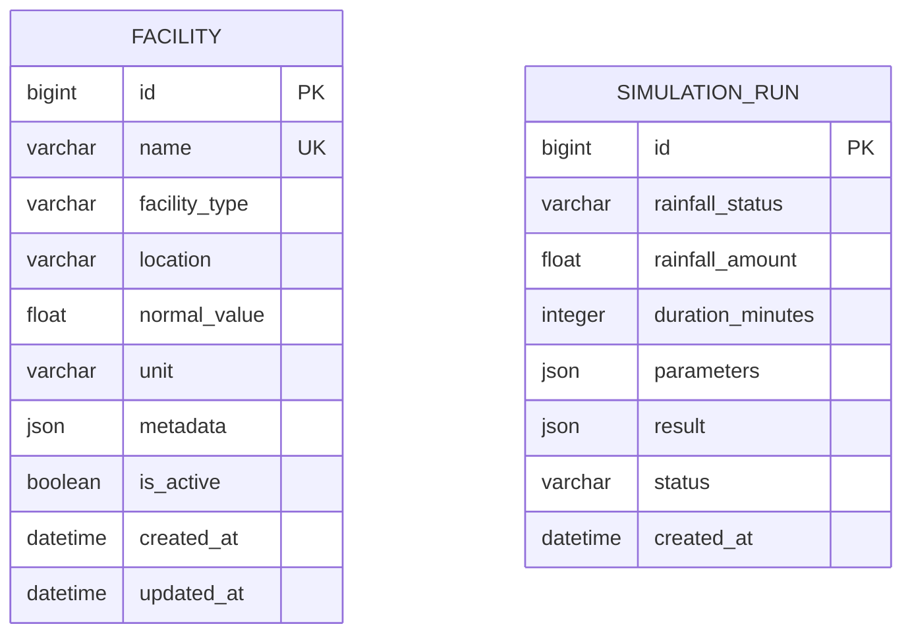

# 데이터베이스 구조

## 개요

- DBMS: SQLite
- Django ORM: Django 6.0.6
- 개발 DB: `db.sqlite3`
- Docker DB: `/data/db.sqlite3`
- 시간대: `Asia/Seoul`

## ERD

현재 두 테이블 사이에 외래 키는 없다. 시뮬레이션 결과에는 실행 당시 시설별
측정 결과가 JSON 스냅샷으로 저장된다.

## Facility

초기화 시 전달받은 시설의 정상 기준값을 저장한다.

| 컬럼 | Django 타입 | Null | 기본값 | 제약/설명 |
| --- | --- | --- | --- | --- |
| `id` | BigAutoField | 아니요 | 자동 증가 | PK |
| `name` | CharField(100) | 아니요 | 없음 | Unique |
| `facility_type` | CharField(30) | 아니요 | `OTHER` | 시설 유형 선택값 |
| `location` | CharField(255) | 아니요 | 빈 문자열 | 위치 설명 |
| `normal_value` | FloatField | 아니요 | `0.0` | 정상 상태 기준값 |
| `unit` | CharField(20) | 아니요 | 빈 문자열 | 기준값 단위 |
| `metadata` | JSONField | 아니요 | `{}` | 임계값 등 확장 데이터 |
| `is_active` | BooleanField | 아니요 | `true` | 시뮬레이션 포함 여부 |
| `created_at` | DateTimeField | 아니요 | 생성 시각 | 자동 기록 |
| `updated_at` | DateTimeField | 아니요 | 수정 시각 | 자동 갱신 |

기본 조회 순서는 `id` 오름차순이다.

## SimulationRun

시뮬레이션 입력과 엔진 결과를 실행 단위로 저장한다.

| 컬럼 | Django 타입 | Null | 기본값 | 제약/설명 |
| --- | --- | --- | --- | --- |
| `id` | BigAutoField | 아니요 | 자동 증가 | PK |
| `rainfall_status` | CharField(50) | 아니요 | 없음 | 강수 상황 |
| `rainfall_amount` | FloatField | 아니요 | `0.0` | 강수량 |
| `duration_minutes` | PositiveIntegerField | 아니요 | `0` | 지속 시간 |
| `parameters` | JSONField | 아니요 | `{}` | 엔진 확장 입력 |
| `result` | JSONField | 아니요 | `{}` | 측정값과 이상 현상 결과 |
| `status` | CharField(20) | 아니요 | `COMPLETED` | `COMPLETED`, `FAILED` |
| `created_at` | DateTimeField | 아니요 | 생성 시각 | 자동 기록 |

기본 조회 순서는 `created_at` 내림차순이다.

## 마이그레이션

- `apps/facilities/migrations/0001_initial.py`
- `apps/simulation/migrations/0001_initial.py`

스키마 변경 시 모델 수정, `makemigrations`, `migrate`, 테스트, 본 문서 갱신을
한 작업 단위로 처리한다.
